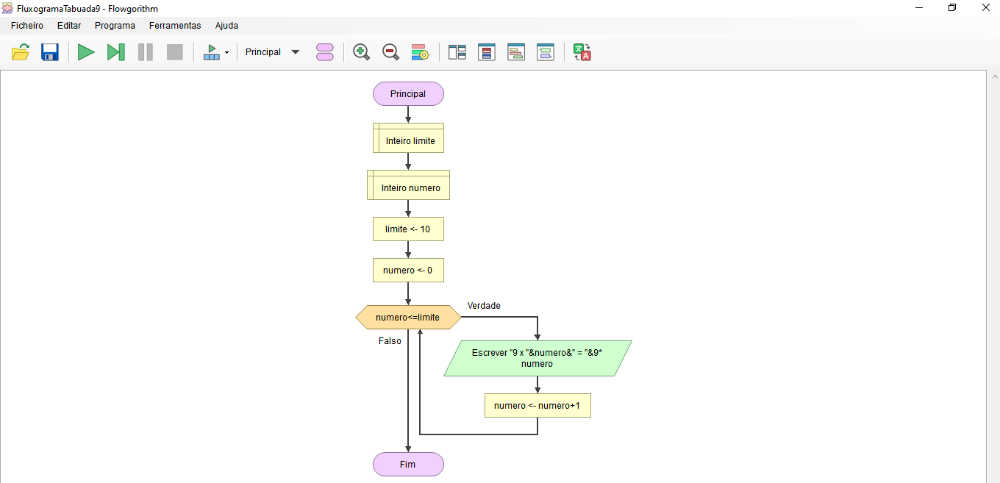

# Tabuada do 9
Objetivo: Exercício em Portugol juntamente com fluxograma construído em software Flowgorithm.
Observação: Portugol não é uma linguagem de programação. Trata-se de uma maneira de representar meu algoritmo através de pseudocódigo.

<h4 align="center"> 
	🚧  Exercício 🚀 Finalizado...  🚧
</h4>

Autora: Renata Silva Bezerra

